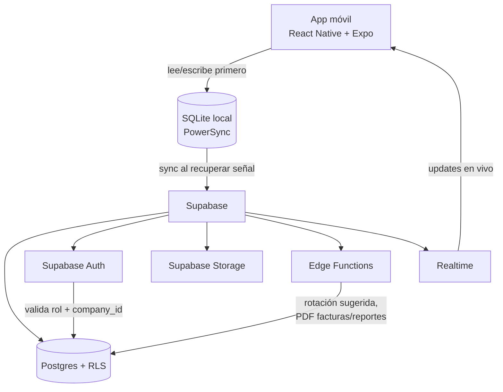

# Project Context

**Generated**: 2026-08-18 (agteamos-new-project, Step 2)
**Fuente**: `documents/01` a `documents/06` (documentación de producto pre-existente)

## Resumen del producto

Zarpe Islands (nombre provisional) es una app de gestión operativa para negocios de turismo náutico en zonas de islas (excursiones, tours, renta de embarcaciones con tripulación). Centraliza mantenimiento de barcos, rotación de personal, control de asistencia (ponche) offline-first, registro de propinas y roles diferenciados por tipo de usuario. Multi-tenant desde el diseño de base de datos, con interfaz en inglés e i18n (inglés/español) desde el día uno.

## Arquitectura de alto nivel

Patrón: **offline-first móvil + BaaS multi-tenant**. La app nunca depende de tener señal para las operaciones críticas de campo (ponche, propina, ver horario); Supabase/Postgres es la fuente de verdad una vez sincronizado, con RLS como barrera real de seguridad (no solo filtrado en la app).

## Stack

| Capa | Tecnología | Justificación |
|---|---|---|
| App móvil | React Native + Expo | Un solo código para Android/tablet/iOS; aprovecha experiencia previa del equipo con React + Supabase |
| Backend/DB | Supabase (Postgres, Auth, Storage, Edge Functions, Realtime) | BaaS completo, evita mantener backend propio para el MVP |
| Seguridad multi-tenant | Row Level Security (RLS) por `company_id` | Aislamiento de datos entre empresas sin bases de datos separadas |
| Sync offline | PowerSync + SQLite local | Evita construir sincronización a mano; resuelve el punto más delicado del proyecto (ponche/propinas en altamar sin señal) |
| Notificaciones | Expo Notifications / Firebase Cloud Messaging | Recordatorios de turno/mantenimiento, entregados al recuperar señal |
| Documentos/facturas | PDF vía Edge Function | Reutiliza enfoque ya usado en otro proyecto del equipo (PunchBot) |
| i18n | i18next / react-i18next | Inglés como base del código, español incluido desde el día uno |

## Decisiones arquitectónicas clave

- **Multi-tenant desde el día uno**: toda tabla principal lleva `company_id`; RLS es la barrera final, no la app.
- **Separación identidad vs. membresía**: `auth.users` (Supabase Auth) vs. `company_members` (rol + datos por empresa) — permite que una persona pertenezca a más de una empresa a futuro.
- **Auditoría obligatoria**: aprobaciones, ediciones de registros pasados y cambios de rotación quedan en `audit_log` (hay dinero e historial laboral de por medio).
- **Catálogos configurables por empresa** (`job_positions`, `maintenance_categories`) en vez de enums fijos de Postgres.
- **Sin Docker/backend propio en esta fase**: al ser Supabase (gestionado) + Expo, no hay servicios locales que orquestar vía `docker-compose`. Se reevalúa si en el futuro se agrega un backend propio (ej. panel web administrativo con servidor dedicado).

Ver documentos fuente para el detalle completo: [`../../documents/02-Arquitectura-y-Tecnologias-ZarpeIslands.md`](../../documents/02-Arquitectura-y-Tecnologias-ZarpeIslands.md), [`05-Modelo-de-Base-de-Datos`](../../documents/05-Modelo-de-Base-de-Datos-ZarpeIslands.md), [`06-Algoritmo-de-Rotacion`](../../documents/06-Algoritmo-de-Rotacion-ZarpeIslands.md).
